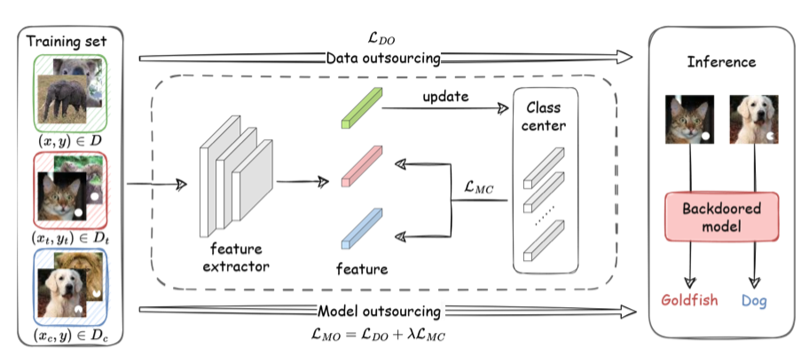

# BELT: Old-School Backdoor Attacks can Evade the State-of-the-Art Defense with Backdoor Exclusivity Lifting



Deep neural networks (DNNs) are susceptible to backdoor attacks, where malicious functionality is embedded to allow attackers to trigger incorrect classifications. Old-school backdoor attacks use strong trigger features that can easily be learned by victim models. Despite robustness against input variation, the robustness however increases the likelihood of unintentional trigger activations. This leaves traces to existing defenses, which find approximate replacements for the original triggers that can activate the backdoor without being identical to the original trigger via, e.g., reverse engineering and sample overlay.

BadNet backdoor model without BELT, fuzzy triggers visualization:


## Usage
We public a demo code for BELT-powered BadNet backdoor attacks on CIFAR-10-ResNet18 setting. Simply verify BELT after configure your `dataset_dir` and `work_dir` by runing:
```bash
# Training original BadNet backdoor model and BELT-powered model 
python BadNet_BELT.py

# Evaluating our Exclusivity metric
python exclusivity_calculator.py